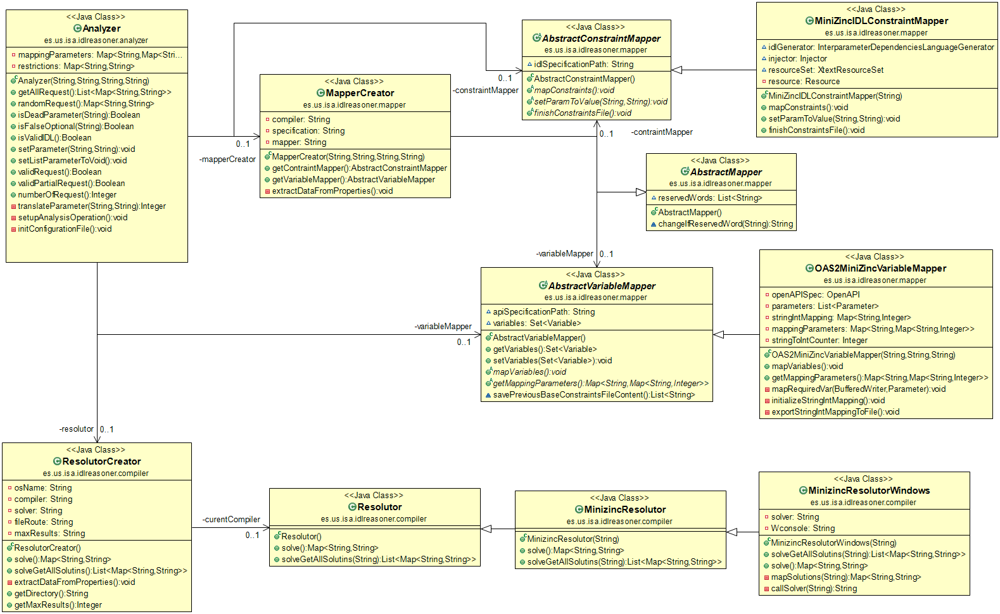

# IDL-Analyzer

This is an Analyzer that analyses the inter-dependencies bewteen parameters in an API REST.
The Analyzer object need the API Specifications giving by a URL (In yaml or json), a idl file, the operation name
and the operation type

```java
	Analyzer a = new Analyzer({.ild file}, {API Specifications URL},
	 {Operation type (REEST)}, {Operation name});
```

## The Project structure

This is the current UML Class Diagram:



The ResolutorCreator class is the class where the resolver specified in the config.properties file will be created, currently the unique resolutor is Minizinc, but it is possible to add a new resolutor as Choco. Also this class will call a different constructor according to operating system, because the command console will be different depending on the operating system. 
 
```java
		public ResolutorCreator() {

		this.osName = System.getProperty("os.name");
		this.extractDataFromProperties();

		if(this.compiler.equals("Minizinc")) {	
			
			if(this.osName.contains("Windows")) {

				this.curentCompiler = new MinizincResolutorWindows(this.fileRoute, this.solver);
				
			}else{
				
				this.curentCompiler = new MinizincResolutor(this.fileRoute, this.solver);
			}
			

		}else {
			this.curentCompiler = new Resolutor(fileRoute);
		}

```

So if we want to add a new resolutor we must create a Resolutor child and then, we must create a child of the new class made according to the operating system.